# Payroll Generator Design Document

This document is meant to provide a tool for you to demonstrate the design process. You need to work on this before you code, and after have a finished product. That way you can compare the changes, and changes in design are normal as you work through a project. It is contrary to popular belief, but we are not perfect our first attempt. We need to iterate on our designs to make them better. This document is a tool to help you do that.

## (INITIAL DESIGN): Class Diagram

Place your class diagram below. Make sure you check the fil in the browser on github.com to make sure it is rendering correctly. If it is not, you will need to fix it. As a reminder, here is a link to tools that can help you create a class diagram: [Class Resources: Class Design Tools](https://github.com/CS5004-khoury-lionelle/Resources?tab=readme-ov-file#uml-design-tools)

```mermaid
    classDiagram
        class IEmployee {
            <<interface>>
            + getName() : String
            + getID() : String
            + getPayRate() : double
            + getEmployeeType() : String
            + getYTDEarnings() : double
            + getYTDTaxesPaid() : double
            + getPretaxDeductions() : double
            + runPayroll(double hoursWorked) : IPayStub 
            + toCSV() : String
        }
    
        class IPayStub {
            <<interface>>
            + getPay() : double
            + getTaxesPaid() : double
            + toCSV() : String
        }
    
        class ITimeCard {
            <<interface>>
            + getEmployeeID() : String
            + getHoursWorked() : double
        }       
    
        Employee ..|> IEmployee : implements
        PayStub ..|> IPayStub : implements
        TimeCard ..|> ITimeCard : implements
    
        Employee <|-- SalaryEmployee
        Employee <|-- HourlyEmployee
    
        PayrollGenerator ..> IEmployee : uses
        PayrollGenerator ..> ITimeCard : uses
        PayrollGenerator ..> FileUtil : uses
        PayrollGenerator ..> Builder : uses
        PayrollGenerator -- Arguments : contains
    
        Employee ..> PayStub : uses
        Builder ..> IEmployee : creates
        Builder ..> ITimeCard : creates
        Builder ..> PayStub : creates
    
        class PayrollGenerator {
            - DEFAULT_EMPLOYEE_FILE : String
            - DEFAULT_PAYROLL_FILE : String
            - DEFAULT_TIME_CARD_FILE : String
            - PayrollGenerator()
            + main(String[] args) : void
        }
    
        class Arguments {
            - employeeFile: String 
            - payrollFile: String
            - timeCards: String
            + getEmployeeFile() : String
            + getPayrollFile() : String
            + getTimeCards() : String
            + printHelp() : void
            + static process(String[] args) : Arguments
        }
    
        class Builder {
            - Builder()
            + buildEmployeeFromCSV(String csv) : IEmployee
            + buildTimeCardFromCSV(String csv) : ITimeCard
            + createPayStub(String employeeName, double pay, double taxesPaid, double ytdEarnings, double ytdTaxesPaid) : PayStub
        }
    
        class FileUtil {
            + EMPLOYEE_HEADER : String
            + PAY_STUB_HEADER : String
            - FileUtil()
            + readFileToList(String file) : List<String>
            + writeFile(String outFile, List<String> lines) : void
            + writeFile(String outFile, List<String> lines, boolean backup) : void
        }
    
        class Employee {
            <<Abstract>>
            - name: String
            - id: String
            - payRate: double
            - pretaxDeductions: double
            - ytdEarnings: double
            - ytdTaxesPaid: double
            + getName() : String
            + getID() : String
            + getPayRate() : double
            + getYTDEarnings() : double
            + getYTDTaxesPaid() : double
            + getPretaxDeductions() : double
            # calculateGrossPay(double hoursWorked)* : double
            + runPayroll(double hoursWorked) : IPayStub
            + toCSV() : String
        }
    
        class HourlyEmployee {
            + HourlyEmployee(String name, String id, double payRate, double ytdEarnings, double ytdTaxesPaid, double pretaxDeductions)
            + getEmployeeType() : String
        }
    
        class SalaryEmployee {
            + SalaryEmployee(String name, String id, double payRate, double ytdEarnings, double ytdTaxesPaid, double pretaxDeductions)
            + getEmployeeType() : String
        }
    
        class PayStub {
            - employeeName: String
            - grossPay: double
            - netPay: double
            - tax: double
            - ytdEarnings: double
            - ytdTaxesPaid: double
            + getPay() : double
            + getTaxesPaid() : double
            + toCSV() : String
        }
    
        class TimeCard {
            - employeeID: String
            - hoursWorked: double
            + getEmployeeID() : String
            + getHoursWorked() : double
        }

```

## (INITIAL DESIGN): Tests to Write - Brainstorm

Write a test (in english) that you can picture for the class diagram you have created. This is the brainstorming stage in the TDD process. 

> [!TIP]
> As a reminder, this is the TDD process we are following:
> 1. Figure out a number of tests by brainstorming (this step)
> 2. Write **one** test
> 3. Write **just enough** code to make that test pass
> 4. Refactor/update  as you go along
> 5. Repeat steps 2-4 until you have all the tests passing/fully built program

You should feel free to number your brainstorm.
1. Test that the `Employee` class properly returns `name` from `getName()`
    - Create a `HourlyEmployee` instance and check if `getName()` returns the correct name.
    - Create a `SalaryEmployee` instance and check if `getName()` returns the correct name.

2. Test that the `Employee` class properly returns `id` from `getID()`
    - Create a `HourlyEmployee` instance and check if `getID()` returns the correct ID.
    - Create a `SalaryEmployee` instance and check if `getID()` returns the correct ID.

3. Test that the `Employee` class properly returns `payRate` from `getPayRate()`
    - `HourlyEmployee.getPayRate()` should return the correct pay rate.
    - `SalaryEmployee.getPayRate()` should return the correct pay rate.

4. Test that the `Employee` class properly returns `YTDEarnings` from `getYTDEarnings()`
    - `HourlyEmployee.getYTDEarnings()` should return the correct year-to-date earnings.
    - `SalaryEmployee.getYTDEarnings()` should return the correct year-to-date earnings.

5. Test that the `Employee` class properly returns `YTDTaxesPaid` from `getYTDTaxesPaid()`
    - `HourlyEmployee.getYTDTaxesPaid()` should return the correct year-to-date taxes paid.
    - `SalaryEmployee.getYTDTaxesPaid()` should return the correct year-to-date taxes paid.

6. Test that the `Employee` class properly returns `pretaxDeductions` from `getPretaxDeductions()`
    - `HourlyEmployee.getPretaxDeductions()` should return the correct pre-tax deductions.
    - `SalaryEmployee.getPretaxDeductions()` should return the correct pre-tax deductions.

7. Test that the `HourlyEmployee` class properly returns `"HOURLY"` from `getEmployeeType()`
8. Test that the `HourlyEmployee` class correctly calculates `runPayroll(40)` (no overtime)
9. Test that the `HourlyEmployee` class correctly calculates `runPayroll(45)` (with overtime pay applied)

10. Test that the `SalaryEmployee` class properly returns `"SALARY"` from `getEmployeeType()`
11. Test that the `SalaryEmployee` class correctly calculates `runPayroll(0)` (fixed salary per pay period)

12. Test that the `TimeCard` class properly returns `employeeID` from `getEmployeeID()`
13. Test that the `TimeCard` class properly returns `hoursWorked` from `getHoursWorked()`

14. Test that the `PayStub` class properly returns `pay` from `getPay()`
15. Test that the `PayStub` class properly returns `taxesPaid` from `getTaxesPaid()`
16. Test that the `PayStub` class correctly formats CSV output from `toCSV()`

17. Test that the `Builder` class correctly parses `"HOURLY,John Doe,12345,15.00,100.0,1000.00,100.00"` into a `HourlyEmployee`
18. Test that the `Builder` class correctly parses `"SALARY,Jane Doe,67890,50000.00,200.0,3000.00,500.00"` into a `SalaryEmployee`
19. Test that the `Builder` class correctly parses `"12345,40"` into a `TimeCard`
20. Test that the `Builder` class correctly parses `"67890,35"` into a `TimeCard`

21. Test that the `PayrollGenerator.main()` reads `employees.csv` and `time_cards.csv` correctly
22. Test that the `PayrollGenerator.main()` processes payroll and generates `pay_stubs.csv`
23. Test that the `PayrollGenerator.main()` correctly updates `employees.csv` with new `YTDEarnings` values

## (FINAL DESIGN): Class Diagram

Go through your completed code, and update your class diagram to reflect the final design. Make sure you check the file in the browser on github.com to make sure it is rendering correctly. It is normal that the two diagrams don't match! Rarely (though possible) is your initial design perfect. 

```mermaid
    classDiagram
       class IEmployee {
           <<interface>>
           + getName() : String
           + getID() : String
           + getPayRate() : double
           + getEmployeeType() : String
           + getYTDEarnings() : double
           + getYTDTaxesPaid() : double
           + getPretaxDeductions() : double
           + runPayroll(double hoursWorked) : IPayStub 
           + toCSV() : String
       }
   
       class IPayStub {
           <<interface>>
           + getPay() : double
           + getTaxesPaid() : double
           + toCSV() : String
       }
   
       class ITimeCard {
           <<interface>>
           + getEmployeeID() : String
           + getHoursWorked() : double
       }       
   
       Employee ..|> IEmployee : implements
       PayStub ..|> IPayStub : implements
       TimeCard ..|> ITimeCard : implements
   
       Employee <|-- SalaryEmployee
       Employee <|-- HourlyEmployee
   
       PayrollGenerator ..> IEmployee : uses
       PayrollGenerator ..> ITimeCard : uses
       PayrollGenerator ..> FileUtil : uses
       PayrollGenerator ..> Builder : uses
       PayrollGenerator -- Arguments : contains
   
       Employee ..> PayStub : uses
       Builder ..> IEmployee : creates
       Builder ..> ITimeCard : creates
       Builder ..> PayStub : creates
   
       class PayrollGenerator {
           - DEFAULT_EMPLOYEE_FILE : String
           - DEFAULT_PAYROLL_FILE : String
           - DEFAULT_TIME_CARD_FILE : String
           - PayrollGenerator()
           + main(String[] args) : void
       }
   
       class Arguments {
           - employeeFile: String 
           - payrollFile: String
           - timeCards: String
           + getEmployeeFile() : String
           + getPayrollFile() : String
           + getTimeCards() : String
           + printHelp() : void
           + static process(String[] args) : Arguments
       }
   
       class Builder {
           - Builder()
           + buildEmployeeFromCSV(String csv) : IEmployee
           + buildTimeCardFromCSV(String csv) : ITimeCard
       }
   
       class FileUtil {
           + EMPLOYEE_HEADER : String
           + PAY_STUB_HEADER : String
           - FileUtil()
           + readFileToList(String file) : List<String>
           + writeFile(String outFile, List<String> lines) : void
           + writeFile(String outFile, List<String> lines, boolean backup) : void
       }
   
       class Employee {
           <<Abstract>>
           - name: String
           - id: String
           - payRate: double
           - pretaxDeductions: double
           - ytdEarnings: double
           - ytdTaxesPaid: double
           + getName() : String
           + getID() : String
           + getPayRate() : double
           + getYTDEarnings() : double
           + getYTDTaxesPaid() : double
           + getPretaxDeductions() : double
           # calculateGrossPay(double hoursWorked)* : double
           + runPayroll(double hoursWorked) : IPayStub
           + toCSV() : String
       }
   
       class HourlyEmployee {
           + HourlyEmployee(String name, String id, double payRate, double ytdEarnings, double ytdTaxesPaid, double pretaxDeductions)
           + getEmployeeType() : String
           + calculateGrossPay(double hoursWorked) : double
       }
   
       class SalaryEmployee {
           + SalaryEmployee(String name, String id, double payRate, double ytdEarnings, double ytdTaxesPaid, double pretaxDeductions)
           + getEmployeeType() : String
           + calculateGrossPay(double hoursWorked) : double
       }
   
       class PayStub {
           - employeeName: String
           - netPay: double
           - tax: double
           - ytdEarnings: double
           - ytdTaxesPaid: double
           + getPay() : double
           + getTaxesPaid() : double
           + toCSV() : String
       }
   
       class TimeCard {
           - employeeID: String
           - hoursWorked: double
           + getEmployeeID() : String
           + getHoursWorked() : double
       }




```

> [!WARNING]
> If you resubmit your assignment for manual grading, this is a section that often needs updating. You should double check with every resubmit to make sure it is up to date.

## (FINAL DESIGN): Reflection/Retrospective

> [!IMPORTANT]
> The value of reflective writing has been highly researched and documented within computer science, from learning new information to showing higher salaries in the workplace. For this next part, we encourage you to take time, and truly focus on your retrospective.

Take time to reflect on how your design has changed. Write in *prose* (i.e. do not bullet point your answers - it matters in how our brain processes the information). Make sure to include what were some major changes, and why you made them. What did you learn from this process? What would you do differently next time? What was the most challenging part of this process? For most students, it will be a paragraph or two. 

